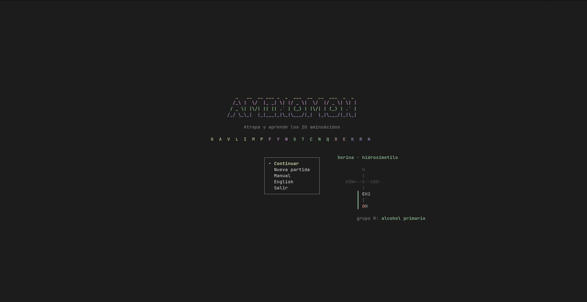
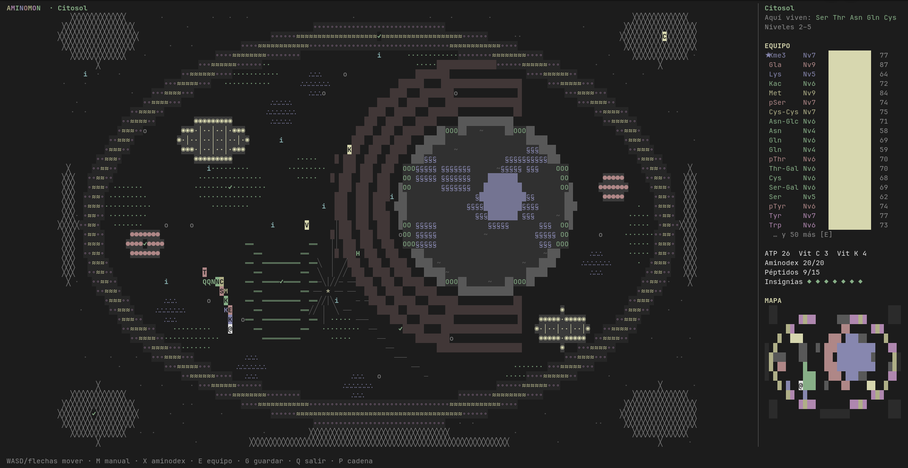
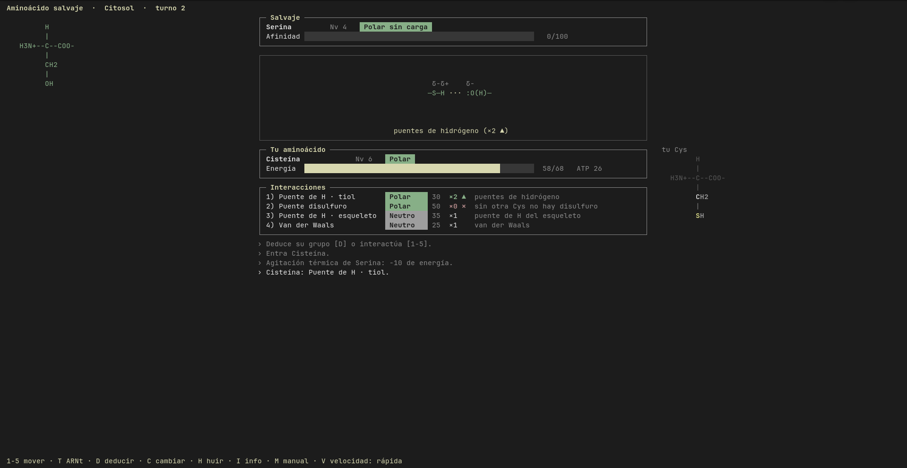

# AMINOMON

*English: `aminomon --en` or «English» on the title screen.*

RPG por turnos en la terminal para aprender los 20 aminoácidos estándar:
cadena lateral, tipo químico, carga, pK1/pK2/pKR, pI, hidropatía,
clasificación nutricional, codones y modificaciones postraduccionales.

Capturas aminoácidos en una célula, combates con interacciones químicas reales
y construyes péptidos para vencer a 7 jefes y al René-virus.

## Capturas







## Instalación

### Windows

1. Instala Python 3 desde [python.org](https://www.python.org/downloads/). En el
   instalador marca «Add python.exe to PATH».
2. Descarga el juego: botón verde **Code → Download ZIP** y descomprímelo.
3. Abre `jugar.bat` con doble clic. La primera vez instala `windows-curses`
   (necesita internet).

Se ve mejor en Windows Terminal (viene en Windows 11) con la ventana maximizada.

### Linux y macOS

```bash
git clone https://github.com/leomorgzzz/aminomon.git
cd aminomon
./instalar.sh        # crea el comando `aminomon` en ~/.local/bin
aminomon
```

Sin instalar: `python3 aminomon.py`. Quitar el comando: `./instalar.sh --quitar`.

Requiere Python 3 (en Linux y macOS, solo la biblioteca estándar). Funciona
desde 80×24; se ve mejor en pantalla completa.

Archivos que crea:

- `~/.aminomon.json`: la partida (en Windows, `~` es `C:\Users\<tu usuario>`);
- `~/.aminomon_idioma`: el idioma.

## Controles

| Mapa | Acción |
|---|---|
| Flechas / WASD | moverse |
| M / ? | manual (también en combate) |
| X | Aminodex |
| E | equipo: líder (Enter), ordenar (O), modificar (V) |
| G / Q | guardar / guardar y salir |
| P | mostrar u ocultar la cadena que te sigue |

| Combate | Acción |
|---|---|
| 1-5 | interacciones |
| D | deducir el grupo del rival |
| T | lanzar ARNt para capturar |
| C / H / I | cambiar / huir / detalle de interacciones |
| V | velocidad de las animaciones |

Cualquier tecla salta una animación.

## Menú

- **Continuar** / **Nueva partida**.
- **Manual**.
- **English / Español**: cambia el idioma.
- **Salir**.

## Fuentes

- Valores fisicoquímicos y grupos de cadena lateral: Lehninger, a 25 °C.
- Hidropatía: escala de Kyte-Doolittle (1982).
